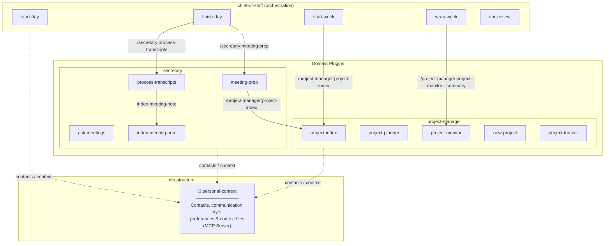

# Chief of Staff

AI-enabled orchestration layer for Claude Code. Five skills that keep you deliberate about your time and moving purposefully through each day and week — coordinating the `secretary`, `project-manager`, and `personal-context` plugins to give you a complete operating system.

**The problem it solves:** Knowledge work is full of context-switching, accumulating commitments, and slow entropy — tasks slip, projects drift, and weeks end without a clear sense of what moved forward. Chief of Staff gives you a structured rhythm: open the week with intention, start each day with a real briefing, close the day cleanly, review the week honestly, and keep your projects and areas from drifting.

---

## Architecture

Chief of Staff is an orchestration layer. It doesn't own project data or meeting memory — those belong to domain plugins that know how to manage them. Chief of Staff knows *when* and *why*; the domain plugins know *how*.



**Dependency direction:**
- `personal-context` is infrastructure — install it first, no dependencies on anything else
- `secretary` and `project-manager` are domain plugins — each owns its own data and operations
- `chief-of-staff` is the orchestration layer — calls into domain plugins, never the reverse

---

## How the Skills Work Together

The five CoS skills form a weekly operating cycle:

```
Monday morning     → /start-week        Set 2–3 priorities, surface project deadlines, create the weekly file
Each morning       → /start-day         Briefing: calendar, priority emails, weekly priorities, tasks, meeting notes
Each evening       → /finish-day        Close out: email triage, brain dump, reschedule, prep tomorrow's meeting notes
Throughout week    → /aor-review        Review area health, surface backlog patterns, suggest spinning up projects
Friday afternoon   → /wrap-week         Recap this week, plan next week with priorities, create next week's file
```

The daily rhythm is the foundation: `/finish-day` each evening seeds the context that makes `/start-day` valuable the next morning. The weekly rhythm gives that daily context meaning — priorities set on Monday shape how you rank tasks and allocate focus all week.

**Orchestration:** `/finish-day` automatically calls `/secretary:process-transcripts` and `/secretary:meeting-prep` so meeting notes are processed and tomorrow's prep is ready without an extra step. `/wrap-week` silently calls `/project-manager:project-monitor --summary` and `/aor-review --summary` to inform priority-setting.

---

## Prerequisites

All skills require MCP servers for calendar, tasks, email, and vault access. Set them up once and they persist in your Claude Code user config.

### 1. Todoist

Register the official Todoist MCP server globally in Claude Code:

```bash
claude mcp add --transport http --scope global todoist https://ai.todoist.net/mcp
```

Claude Code will prompt you to authenticate with Todoist the first time a tool is called.

### 2. Google Calendar

**Step 1:** Create a Google Cloud project and enable the Google Calendar API.
Follow the authentication guide at: https://github.com/nspady/google-calendar-mcp#authentication

Download your OAuth credentials JSON file (e.g., to `~/gcp-oauth.keys.json`).

**Step 2:** Register the MCP server:
```bash
claude mcp add --transport stdio \
  --env GOOGLE_OAUTH_CREDENTIALS=$HOME/gcp-oauth.keys.json \
  google-calendar --scope user \
  -- npx -y @cocal/google-calendar-mcp
```

The first time Claude Code uses this server it will open a browser for OAuth consent.

### 3. Gmail

`/start-day` and `/finish-day` check for unread emails labeled `Priority/p1` or `Priority/p2`. Any Gmail MCP server that supports label-based search works. One option using the community `@gptscript-ai/gmail-mcp` server:

```bash
claude mcp add --transport stdio \
  --env GOOGLE_OAUTH_CREDENTIALS=$HOME/gcp-oauth.keys.json \
  gmail --scope user \
  -- npx -y @gptscript-ai/gmail-mcp
```

Set up `Priority/p1` and `Priority/p2` labels in Gmail and apply them to emails that need your attention. The skills search for `label:Priority/p1 OR label:Priority/p2 is:unread` — adjust the query format to match your MCP server's API.

If Gmail MCP is unavailable, both skills degrade gracefully and note that email data was skipped.

### 4. Personal Context

The `personal-context` plugin is a separate installation that provides contact resolution and personal preference files to all plugins. Install it independently — see the `personal-context` plugin README for setup instructions.

### 5. Secretary and Project Manager

`/finish-day` and `/wrap-week` call into the `secretary` and `project-manager` plugins. Install both for the full operating cycle:

- `secretary` — meeting prep, transcript processing, meeting memory
- `project-manager` — project plans, health monitoring, project index

---

## Obsidian Vault Setup

The chief of staff assumes a particular structure to the Obsidian vault based on Tiago Forte's PARA system. Default paths can be overridden two ways: a `CLAUDE.md` config block in the vault root (applied every run), or per-invocation arguments (highest precedence).

### CLAUDE.md Configuration

Add a **Chief of Staff** section to your vault's `CLAUDE.md` to set persistent path defaults — no arguments needed on every invocation. All path-aware skills (across CoS, secretary, and project-manager plugins) read this block on startup.

```markdown
## Chief of Staff
- projects-path: Projects
- daily-notes-path: Journal/Daily
- notes-path: Meetings
- weekly-recaps-path: Reviews/Weekly
- areas-path: Areas
```

| Key | Default | Used by |
|-----|---------|---------|
| `projects-path` | `01-Projects` | project-manager: `/new-project`, `/project-planner`, `/project-tracker`, `/project-index`, `/project-monitor`; secretary: `/meeting-prep` |
| `daily-notes-path` | `02-AreasOfResponsibility/Daily Notes` | `/start-day`, `/finish-day`, `/wrap-week` |
| `notes-path` | `02-AreasOfResponsibility/Notes` | `/start-day`, `/finish-day`; secretary: `/meeting-prep`, `/process-transcripts`; project-manager: `/project-monitor` |
| `weekly-recaps-path` | `02-AreasOfResponsibility/Weekly Recaps` | `/start-week`, `/start-day`, `/wrap-week` |
| `areas-path` | `02-AreasOfResponsibility` | `/wrap-week`, `/aor-review` |

Precedence: per-invocation argument > `CLAUDE.md` value > hardcoded default.

### Per-invocation Overrides

Any skill argument takes highest precedence for that run:

```
/start-day --daily-notes-path "Journal/Daily" --notes-path "Meetings"
/wrap-week --weekly-recaps-path "Reviews/Weekly"
```

The skills assume this folder structure in your vault:

```
vault/
├── 01-Projects/            ← one subfolder per *owned/led* project, each with a PLAN.md
│   ├── my-project/
│   │   ├── Notes/          ← Project specific notes
│   │   │   └── a-note.md
│   │   └── PLAN.md
│   ├── Watched/            ← one subfolder per *monitored* project, each with a PLAN.md
│   │   └── my-project/
│   │       └──PLAN.md
│   └── ...
├── 02-AreasOfResponsibility/
    ├── Daily Notes/        ← lightweight day hubs (created by /start-day)
    │   ├── 2026-03-30.md
    │   └── ...
    ├── Notes/              ← your existing meeting notes (untouched)
    │   ├── 1:1 with Alex.md
    │   ├── Team Standup.md
    │   └── ...
    └── Weekly Recaps/      ← narrative weekly summaries (created by /wrap-week)
        ├── 2026-W13.md
        └── ...
```

### Daily Notes
Enable the **Daily Notes** core plugin in Obsidian (Settings → Core Plugins → Daily Notes):
- Folder: `Daily Notes`
- Date format: `YYYY-MM-DD`
- Template: optional — `/start-day` will create notes with its own template


### Notes
The `Notes/` folder is where meeting notes are maintained. Files in this folder are never modified except to append new date sections for recurring meetings by `/finish-day`. No content is moved or duplicated.

### Projects
Every project has its own folder with at least a `PLAN.md` file that contains the plan overview. Notes specific to the project can be contained within a `Notes/` folder in the project. Projects that are of interest but not being directly led by the user go into sub-folders within `Watched/`. Projects are assumed to have a Todoist project named the same. The `/project-manager:new-project` skill will create a project folder, Todoist project and kick off the appropriate skill to generate the right PLAN.md file.

---

## Transcript Workflow

By default, `/finish-day` shows a checklist reminder to download transcripts and drop them in your n8n pickup folder.

If connected with an MCP server, processing can be automatically triggered by passing the server name to finish-day:

```
/finish-day --transcript-mcp n8n
```

---

## Skills Reference

These are the five skills that live in the chief-of-staff plugin. For meeting skills (`/meeting-prep`, `/process-transcripts`, `/ask-meetings`) see the `secretary` plugin. For project skills (`/project-planner`, `/project-monitor`, `/new-project`, etc.) see the `project-manager` plugin.

| Skill          | Description                                                                                                    | When to use                                          |
| -------------- | -------------------------------------------------------------------------------------------------------------- | ---------------------------------------------------- |
| `/start-week`  | Set 2–3 weekly priorities, surface project deadlines via project-manager, create weekly planning file          | Monday morning                                       |
| `/start-day`   | Morning briefing with priority emails, weekly priorities, calendar, tasks, and meeting notes                   | Each morning before starting work                    |
| `/finish-day`  | Day close-out: email triage, brain dump, reschedule tasks, process today's transcripts, prep tomorrow's notes  | Each evening before logging off                      |
| `/wrap-week`   | Recap this week (1/3), plan next week with 2–3 priorities (2/3), creates next week's planning file             | Friday afternoon or Sunday evening                   |
| `/aor-review`  | Review each Area of Responsibility — open task counts, age flags, suggest spinning up projects where warranted | On demand, or automatically (silently) by /wrap-week |

### Arguments

**`/start-week`**
- `--weekly-recaps-path <path>` — Override weekly recaps folder (default: `02-AreasOfResponsibility/Weekly Recaps`)

**`/start-day`**
- `--daily-notes-path <path>` — Override default daily notes folder (default: `02-AreasOfResponsibility/Daily Notes`)
- `--notes-path <path>` — Override meeting notes folder (default: `02-AreasOfResponsibility/Notes`)

**`/finish-day`**
- `--daily-notes-path <path>` — Override default daily notes folder
- `--notes-path <path>` — Override meeting notes folder
- `--transcript-mcp <server-name>` — Name of an MCP server to trigger for transcript processing

**`/wrap-week`**
- `--daily-notes-path <path>` — Override default daily notes folder
- `--weekly-recaps-path <path>` — Override weekly recaps folder (default: `02-AreasOfResponsibility/Weekly Recaps`)
- `--areas-path <path>` — Override areas of responsibility root folder (default: `02-AreasOfResponsibility`)
- `--focus <text>` — Specify a theme or area to emphasize when setting next week's priorities

**`/aor-review`**
- `--areas-path <path>` — Override areas of responsibility root folder (default: `02-AreasOfResponsibility`)
- `--summary` — Run in silent summary mode (no interaction, structured output only — used by `/wrap-week`)

---

## Tips

**Run the full cycle for the first two weeks.** The skills get meaningfully richer when they can read context from each other. `/start-day` reads the weekly priorities `/start-week` set. `/wrap-week` reads the daily notes `/start-day` and `/finish-day` wrote. The first week feels lighter; by week three it feels like a real operating system.

**Daily note as a hub.** Keep meeting content in your long-running `Notes/` files. Daily notes link to those notes and capture your intentions and reflections — no duplication.

**Todoist priority discipline.** The morning briefing ranks tasks by p1/p2. If everything is p1, the ranking loses meaning. Consider a personal rule: max 2–3 p1 tasks at any time.

**Calendar blocking.** Block deep-work time as private Google Calendar events. `/start-day` will include those blocks when suggesting focus windows, making the suggestion more useful.

**Weekly recap as a personal changelog.** ISO week filenames (`2026-W13.md`) sort naturally and are easy to review during quarterly or annual reflections.

**Run `/finish-day` before leaving for the day** — not after. The meeting note prep for tomorrow works best when done while context is fresh. It also triggers transcript processing for today's meetings automatically.

**`/aor-review` runs inside `/wrap-week` automatically.** You don't need to run it separately on Fridays — wrap-week invokes it silently and uses its output to inform priority-setting. Run it independently mid-week when you want a focused check-in without going through the full wrap-week flow.

**`/wrap-week` creates next week's file.** You'll start Monday with priorities and project context already written. `/start-week` is still useful if you want a more deliberate Monday planning session, but it's no longer required.
